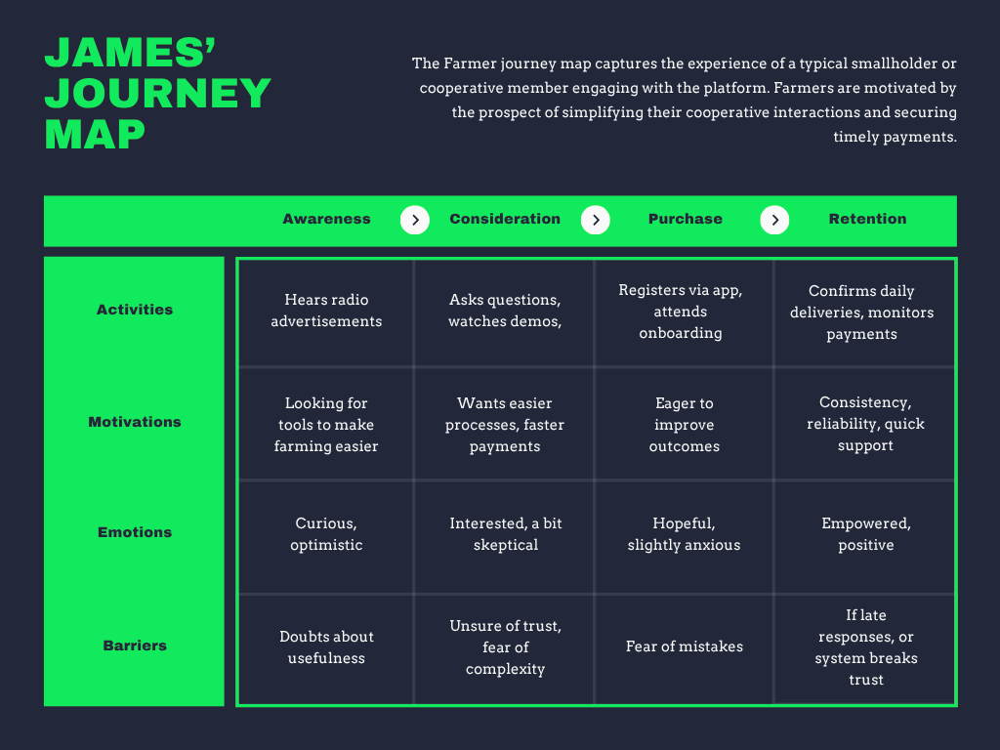
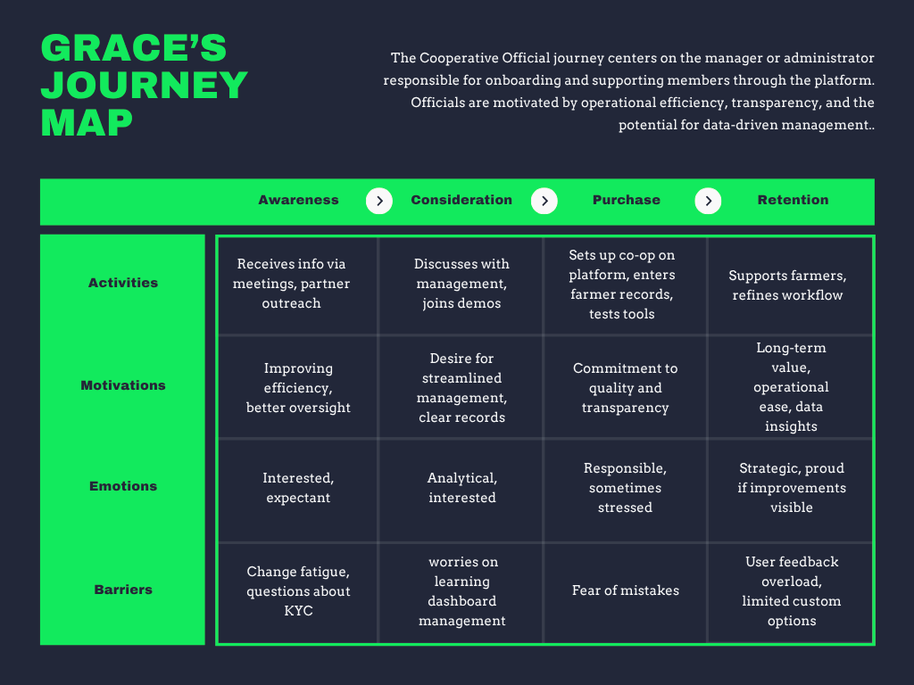

# Customer Journey Maps

## Customer Journey Imbuto Platform

The Customer Journey map outlines the key stages and touchpoints that users experience as they interact with the Imbuto platform. This high-level view helps align stakeholders and optimize the user experience from first awareness through long-term engagement.

## 1. Awareness
- **User Actions:** Individuals learn about Imbuto through community outreach, partner organizations, and online campaigns.
- **Touchpoints:** Social media, community events, newsletters, partner referrals.
- **User Mindset:** Curious and seeking opportunity for growth and empowerment.

## 2. Consideration
- **User Actions:** Prospective users research the platform, explore program offerings, and seek testimonials or demonstrations.
- **Touchpoints:** Website information pages, demo sessions, online reviews, word-of-mouth.
- **User Mindset:** Evaluative, weighing benefits and fit for their needs.

## 3. Registration
- **User Actions:** Users sign up, create profiles, and select programs or initiatives to participate in.
- **Touchpoints:** Online registration portal, onboarding support, welcome communications.
- **User Mindset:** Motivated and hopeful; looking for an easy onboarding experience.

## 4. Active Engagement
- **User Actions:** Users actively participate in programs, submit inputs, track their progress, and interact with the platform tools.
- **Touchpoints:** Mobile apps, web dashboards, notifications, events.
- **User Mindset:** Engaged and supported; expecting meaningful impact and clear communication.

## 5. Retention and Growth
- **User Actions:** Continued participation with the platform, engaging in advanced features, renewing memberships, and advocating for Imbuto.
- **Touchpoints:** Progress reports, community forums, renewal reminders, feedback surveys.
- **User Mindset:** Loyal and empowered; driven by positive outcomes and community connection.

## 6. Support
- **User Actions:** Users seek technical help, guidance on participation, or assistance with platform features.
- **Touchpoints:** Helpdesk, FAQs, chat and call support, help articles.
- **User Mindset:** Confident that support is accessible and responsive.

---

*This high-level customer journey serves as a framework to identify opportunities for improving user experience and delivering lasting value with the Imbuto platform.*
