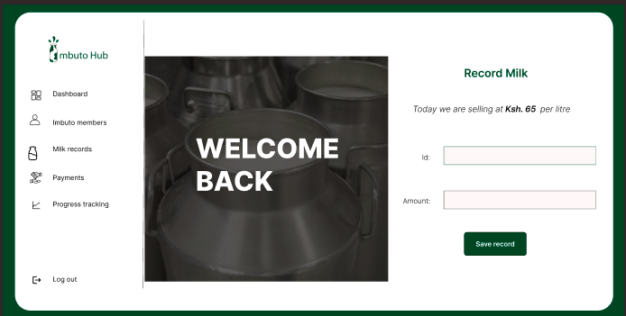
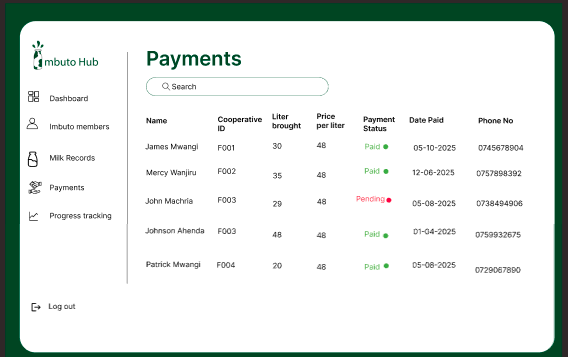
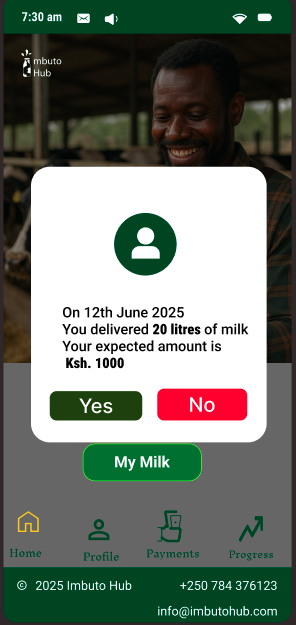

## Market Overview <
 * Rwanda has an estimated 1 million smallholder dairy farmers, many organized into cooperatives.

* The dairy market is growing due to rising domestic demand and government initiatives encouraging milk production.

* Challenges include lack of transparency in milk collection, inconsistent payment, and manual record-keeping by cooperatives.

## Market Opportunity

* Impact opportunity to enhance revenue and payment timeliness, improving livelihoods.

* Currently no widely adopted digital solution tailored to Rwandan dairy cooperatives.

## Business Goals 

* Deploy application to 10 cooperatives within 12 months.

* Achieve 80% farmer adoption within cooperatives.

* Reduce payment delays by 70% within the first year of use.

##  Product Positioning 

Our app stands out due to:

* Simple, user-friendly UI for low-literacy farmers.

* Integrated notifications and financial tracking.

## Business Logic 

### Milk delivery recorded by official → Automatically triggers notification to farmer.

### Payments are linked to specific milk deliveries.<
 

### Only deliver notifications for confirmed or validated milk deliveries.

### Technical Requirements

* Web-based application accessible on desktop for cooperative officials.

* Mobile app for farmers with SMS notification fallback.

* Backend server with secure database.

* Integration planned with Mpesa Deraja APIs.
### Non-Functional Requirements

* Fast performance – pages load within 3 seconds.

* Secure data storage with encryption.

* Scalable architecture to onboard new cooperatives easily.

For more information on market overview checkout our [competitor analysis](./competitor-analysis.md)

