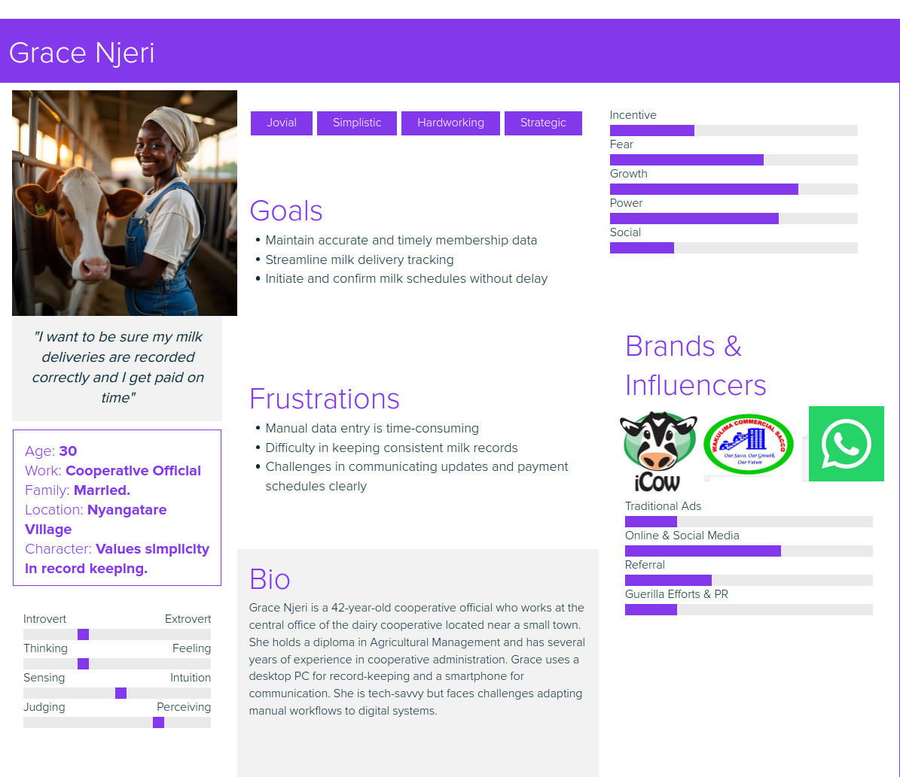
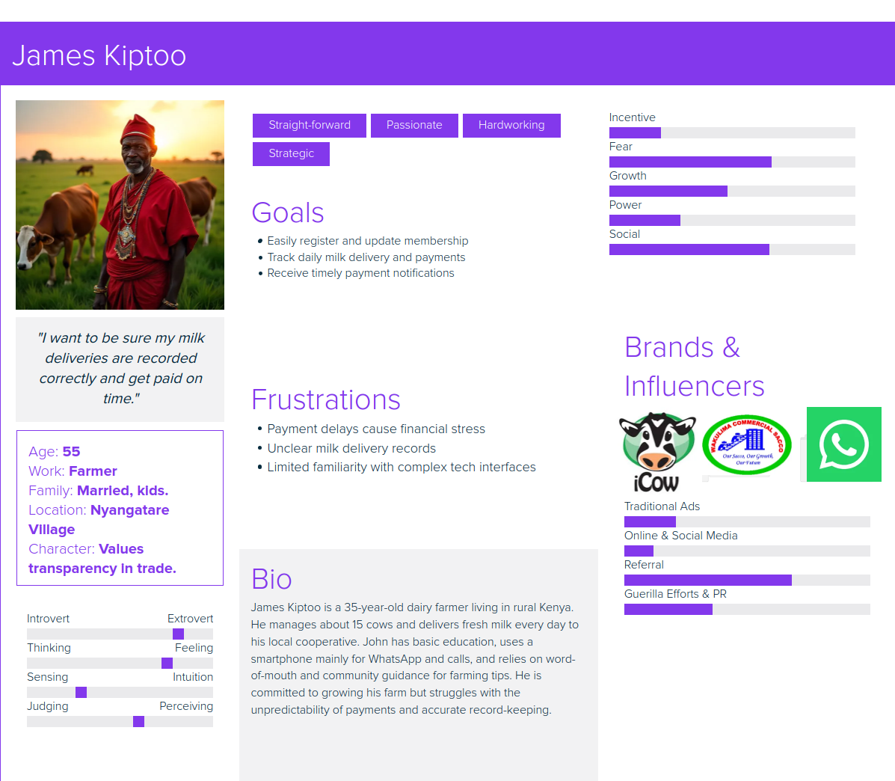

# User / Buyer Personas

## 1. Farmer

- **Demographics:** Small to medium-scale dairy farmer, typically aged 25-55, rural location  
- **Goals:** Easily register and maintain membership, track milk deliveries, receive timely payments, monitor production progress  
- **Pain Points:** Delayed payments, lack of transparency in delivery records, difficulty accessing cooperative services  
- **Technology Usage:** Uses a smartphone or basic computer; prefers simple UI for registration and notifications  

## 2. Cooperative Official

- **Demographics:** Administrator or manager of dairy cooperatives, aged 30-60, mid-level technical proficiency  
- **Goals:** Manage member records, track and validate milk deliveries, initiate payments, analyze cooperative performance  
- **Pain Points:** Time-consuming manual processes, data inconsistencies, payment delays, member communication challenges  
- **Technology Usage:** Regular user of desktop or laptop, familiar with CRM/admin interfaces  
